<div align="center">
  
  <br/><br/>
  <p><strong>Self-hosted home network device management</strong></p>
  <p>
    
    
    
    
    
    
  </p>
</div>

---

MyNet is a self-hosted web application for managing every device on your home network. Track hardware inventory, map subnets, monitor uptime, visualise network topology, manage switch ports, and integrate with Pi-hole and UniFi — all from a single, locally-hosted interface.

Designed to run on a Raspberry Pi or any Linux server on your LAN.

---

## Features

| Category | What you get |
|---|---|
| **Device inventory** | 170+ device types, per-device NICs, credentials, SSH keys, services, notes |
| **Network management** | VLANs, CIDR subnets, DHCP ranges, DNS config, visual subnet maps |
| **Monitoring** | Scheduled ping monitoring, latency sparklines, WAN uptime tracking |
| **Topology** | Auto-derived network graph, point-to-point path tracer |
| **Switch ports** | Visual port diagrams, PoE, WAN configs, uplink mapping |
| **Events & alerts** | Unified audit log, conflict detection, offline alerts, acknowledgement |
| **Locations** | Hierarchical location tree (building → floor → room → rack) |
| **Pi-hole** | Live stats, DNS record sync, query history, blocking control |
| **UniFi** | Client discovery, network sync, side-by-side comparison |
| **QR & labels** | Printable device labels with QR codes linking to device pages |
| **Network scan** | Live ping sweep to discover unknown devices on your subnets |
| **Backup & restore** | Full JSON export/import, factory reset |
| **Users & roles** | Admin / Editor / Viewer with JWT auth and login rate limiting |
| **Encryption** | Optional passphrase-based encryption for stored credentials |

---

## Quick Start

### Requirements

- Ubuntu 22.04+ **or** Raspberry Pi OS Bookworm/Bullseye (headless)
- `git`, `curl` (installed by the setup script)
- ~500 MB free storage (Pi 3B+: use a high-endurance SD card or move the DB to USB)

### Install

```bash
git clone https://github.com/YOUR_USERNAME/mynet.git
cd mynet
sudo bash setup.sh
```

The setup script installs all dependencies (Python, Node.js 20, nginx), builds the frontend, configures a systemd service, and starts MyNet. When it finishes, open the URL shown in the terminal.

### First run

Navigate to `http://<your-server-ip>` and follow the setup wizard to create your admin account.

### Update

```bash
cd mynet
git pull
sudo bash update.sh
```

### Uninstall

To completely remove MyNet, all data, and all installed components:

```bash
sudo bash uninstall.sh
```

You will be prompted to confirm by typing `UNINSTALL`, and asked whether to also remove nginx, Node.js, and any swapfile created during setup. All MyNet data is permanently deleted.

---

## Documentation

| Guide | Description |
|---|---|
| [Getting Started](docs/getting-started.md) | Installation, first run, configuration, updates |
| **Features** | |
| [Devices](docs/features/devices.md) | Device inventory, NICs, types, statuses, credentials |
| [Networks](docs/features/networks.md) | VLANs, subnets, DHCP, DNS, subnet map |
| [Monitoring](docs/features/monitoring.md) | Ping monitoring, WAN monitoring, latency history |
| [Events](docs/features/events.md) | Audit log, alerts, conflict detection, acknowledgement |
| [Topology](docs/features/topology.md) | Network graph, path tracer |
| [Switch Ports](docs/features/switches.md) | Port management, PoE, WAN configs |
| [Locations](docs/features/locations.md) | Hierarchical location tree |
| [Search & Filtering](docs/features/search.md) | Full-text search, filters, subnet map |
| [Backup & Restore](docs/features/backup-restore.md) | Export, import, factory reset |
| [Users & Roles](docs/features/users.md) | User management, permissions, authentication |
| [Settings](docs/features/settings.md) | System config, appearance, encryption |
| [Pi-hole Integration](docs/features/pihole.md) | Stats, DNS sync, query history |
| [UniFi Integration](docs/features/unifi.md) | Client discovery, network sync |
| [QR Codes & Labels](docs/features/qr-labels.md) | Printable labels, QR code generation |
| [Network Scanner](docs/features/network-scan.md) | Live subnet ping sweep |

---

## Tech Stack

| Layer | Technology |
|---|---|
| Backend | Python 3.10+, FastAPI, SQLAlchemy, SQLite, APScheduler |
| Frontend | React 18, TypeScript, Tailwind CSS, Vite, TanStack Query |
| Server | nginx (reverse proxy + static files), systemd |
| Monitoring | icmplib (ICMP ping), WebSocket real-time push |
| Crypto | Fernet (AES-128-CBC), PBKDF2-HMAC-SHA256 (480k iterations) |
| Auth | JWT (python-jose), bcrypt passwords, httpOnly cookies |

---

## Raspberry Pi Notes

**Ping monitoring scale (Pi 3B+):** Safe ceiling is ~300 monitored devices before the 30-second scheduler tick becomes noticeably slow. Raise `concurrent_tasks` in `monitoring_scheduler.py` from 150 to 256 if monitoring more than 150 devices.

**SD card write wear:** At 85 devices the scheduler writes ~70–100 MB/day to SQLite. Standard SD cards may last 2–4 years; high-endurance cards (Samsung Pro Endurance, SanDisk High Endurance) are strongly recommended. To reduce wear: move `DB_PATH` in `.env` to a USB drive, or increase `TICK_SECS` from 30s to 60s.

---

## Screenshots

### Dashboard

<div align="center">
  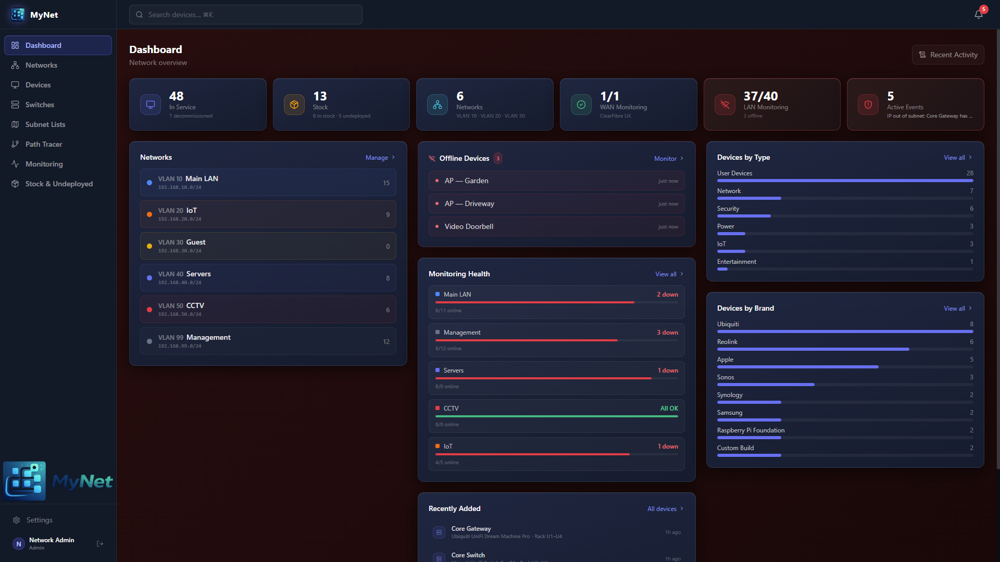
</div>

<div align="center">
  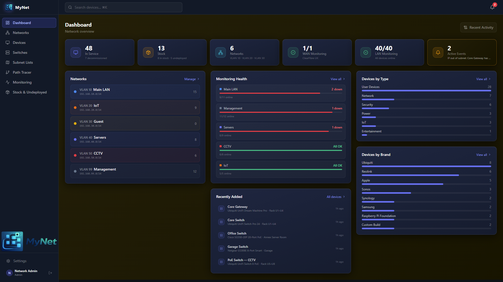
  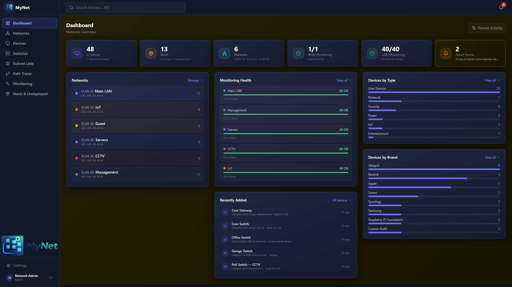
</div>

<div align="center">
  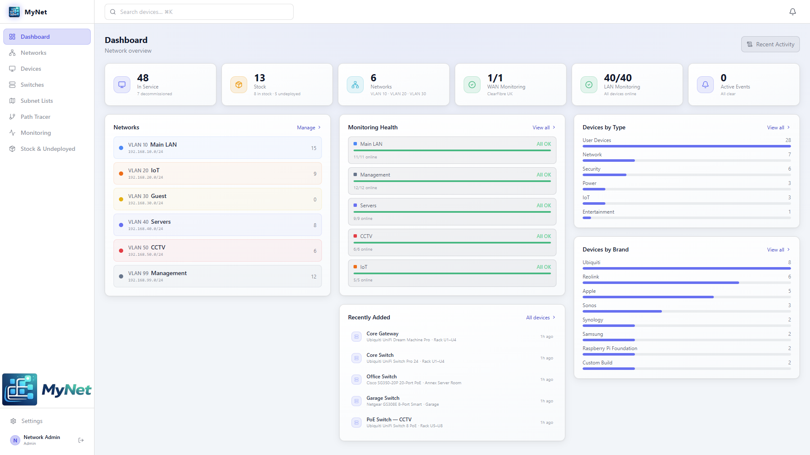
  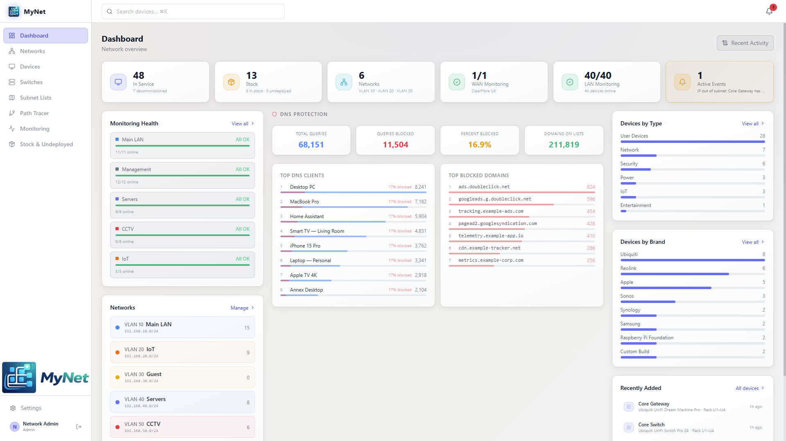
</div>

### Device Inventory

<div align="center">
  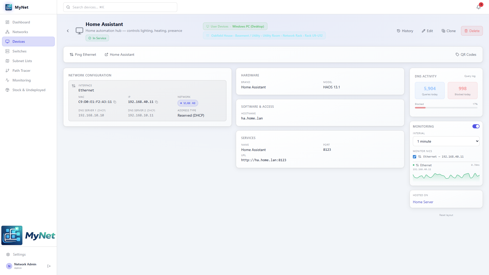
  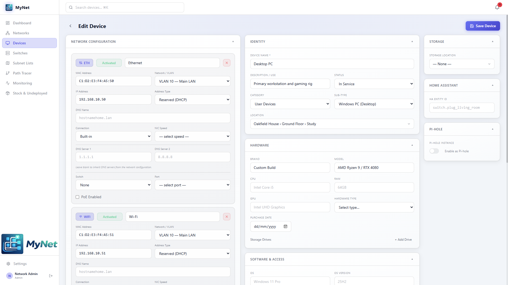
</div>

### Networks & Subnets

<div align="center">
  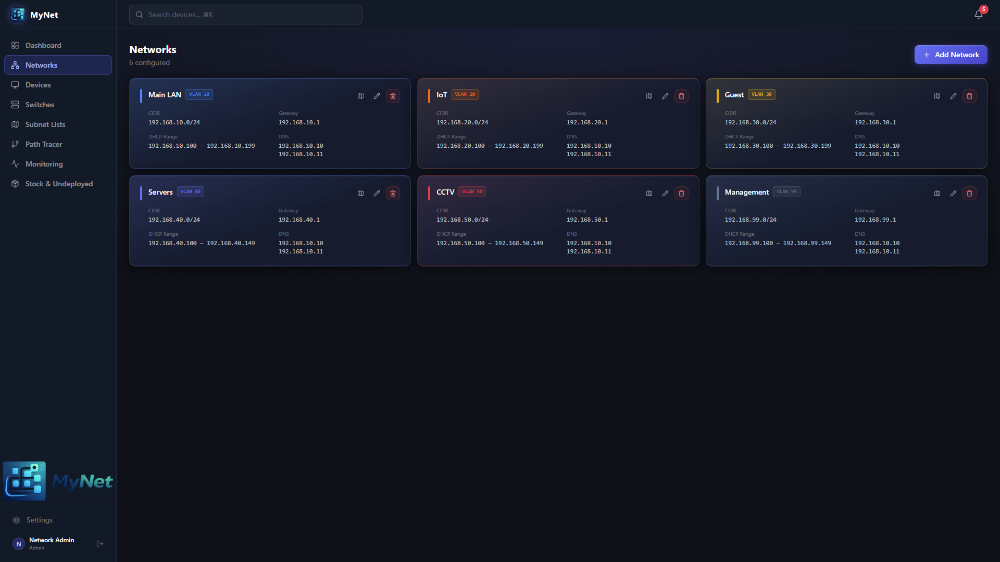
  
</div>

### Monitoring

<div align="center">
  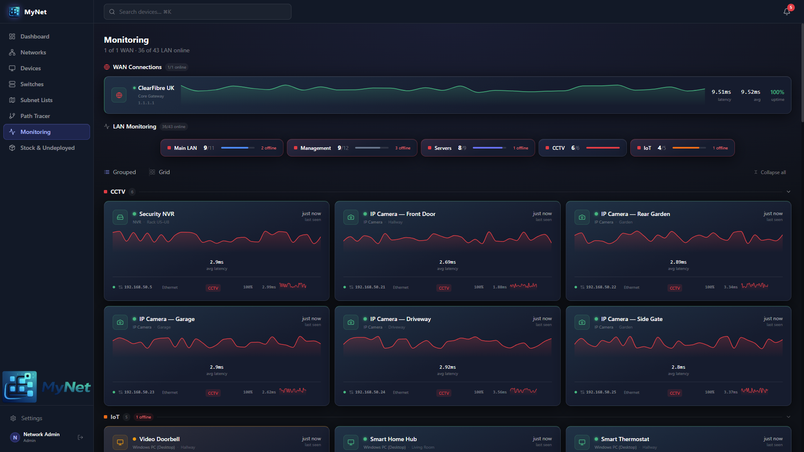
</div>

### Switches, Events & More

<div align="center">
  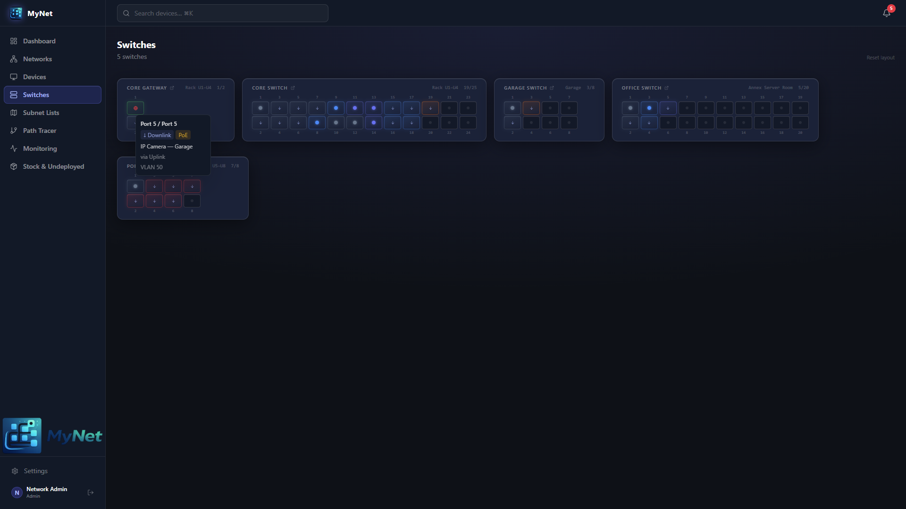
  
</div>

<div align="center">
  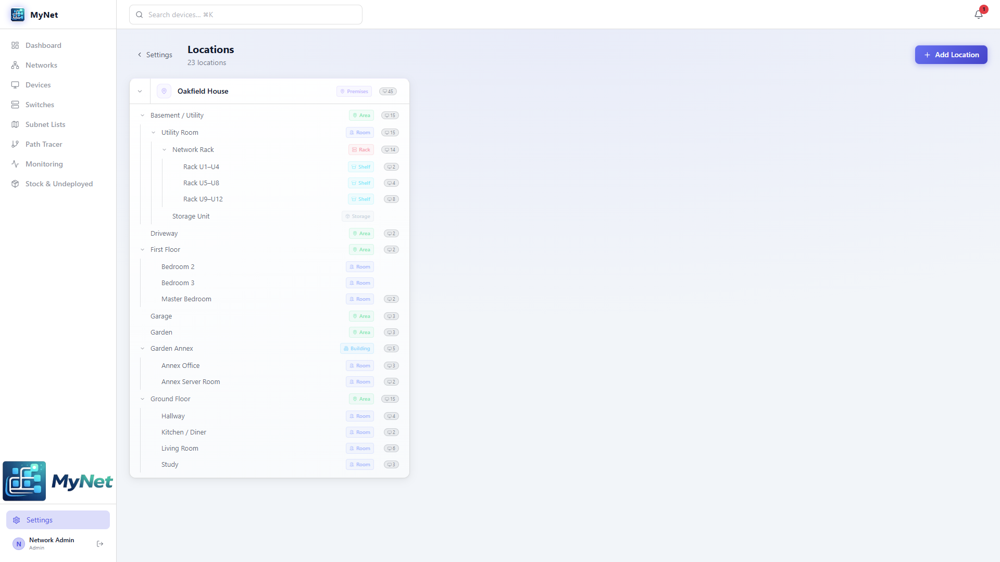
  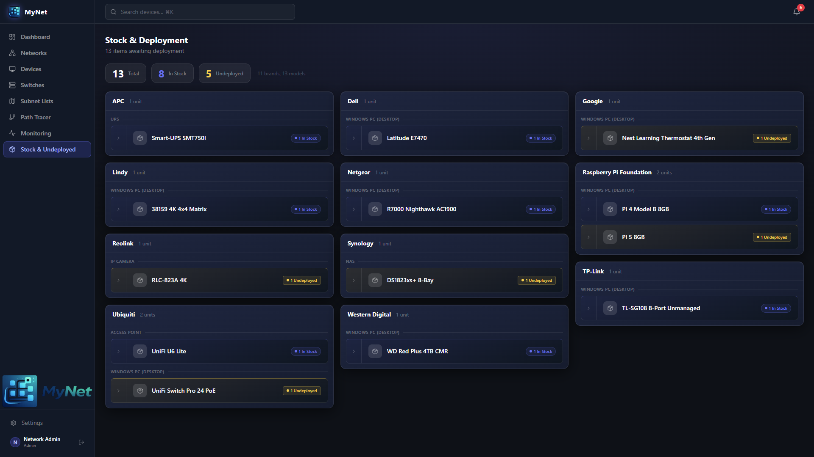
</div>

---

## License

[GNU Affero General Public License v3.0](LICENSE)
