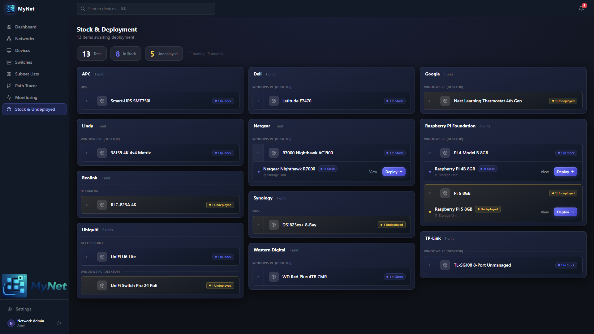

  

# Devices

  

  

  
  

> The device inventory is the heart of MyNet. Every piece of hardware and software on your network lives here — from switches and access points to laptops, phones, IoT sensors, and VMs.

---

## Contents

- [Device List](#device-list)
- [Device Statuses](#device-statuses)
- [Adding a Device](#adding-a-device)
- [Device Types](#device-types)
- [Device Fields Reference](#device-fields-reference)
- [Network Interfaces (NICs)](#network-interfaces-nics)
- [Credentials & SSH](#credentials--ssh)
- [Wake on LAN](#wake-on-lan)
- [Monitoring](#monitoring)
- [Services & URLs](#services--urls)
- [Switch Port Connections](#switch-port-connections)
- [Editing & Deleting](#editing--deleting)
- [Stock & Deployment Workflow](#stock--deployment-workflow)

---

## Device List

The device list (`/devices`) shows all your devices. Use the controls at the top to:

- **Search** across device name, hostname, brand, model, MAC address, IP address, DNS entry, SSID, OS, notes, and URL
- **Filter** by network/VLAN, device type category, status, location, or NIC type
- **Group** by device type category (collapsible sections)
- **Switch view** between grid cards and a compact list

Your filter and view preferences are saved per session.

---

## Device Statuses

Every device has one of four statuses:

| Status | Meaning |
|---|---|
| **In Service** | Active, deployed, and connected to the network |
| **Undeployed** | Exists but not yet put into service |
| **Stock** | Spare or unused hardware in storage |
| **Decommissioned** | Retired, no longer in use |

The device list shows **In Service** devices by default. Use the **Stock** page (`/stock`) to manage undeployed, stock, and decommissioned devices separately.

---

## Adding a Device

Click **+ Add Device** from the device list or navigate to `/devices/new`.

The form adapts to the selected device type — fields that are not relevant to that type are hidden automatically.

### Minimum required fields

| Field | Notes |
|---|---|
| **Name** | A unique, human-readable name (e.g. `Living Room TV`, `Pi-hole 1`) |
| **Device Type** | Select from 170+ predefined types, or a custom type you have created |

Everything else is optional, but the more you fill in, the more useful MyNet becomes.

---

## Device Types

MyNet includes 170+ predefined device types organised into categories. Each type controls which fields appear in the device form.

| Category | Examples |
|---|---|
| User Devices | Windows PC, MacBook, Linux Laptop, Phone, Tablet, Chromebook |
| Network Infrastructure | Network Switch, Router/Gateway, Access Point, Firewall, NAS |
| Servers & VMs | Linux Server, Windows Server, Virtual Machine, Container Host |
| Entertainment | TV, Games Console, Streaming Stick, Media Player, Hi-Fi |
| Security | IP Camera, NVR, Video Doorbell, Smart Lock, Alarm Panel |
| IoT | Smart Speaker, Smart Plug, Thermostat, Light, Sensor, Hub/Bridge |
| Power | UPS, PDU, EV Charger, Solar Inverter, Smart Meter |
| Peripherals | Printer, Scanner, 3D Printer, Dock/Hub, Drawing Tablet |
| Maker & Projects | Raspberry Pi, Arduino, FPGA, Development Board |
| Other | Miscellaneous |

### Custom device types

Go to **Settings → Device Types** to create your own types with a custom name, category, icon, and color.

---

## Device Fields Reference

### General

| Field | Description |
|---|---|
| **Name** | Display name shown throughout MyNet |
| **Use / Purpose** | Brief description of what this device does |
| **Device Type** | Controls which fields are shown |
| **Hardware Type** | Physical form factor (e.g. tower, rackmount, SFF) |
| **Brand / Model** | Manufacturer and model number |
| **Location** | Where the device physically lives (from your [location hierarchy](locations.md)) |
| **Storage Location** | Where a stock/spare device is kept |
| **Status** | In Service, Undeployed, Stock, or Decommissioned |
| **Purchase Date** | Optional, for asset tracking |
| **Notes** | Free-text notes (supports multiple lines) |

### Compute

| Field | Description |
|---|---|
| **CPU / RAM / GPU** | Hardware specs — free text |
| **OS / OS Version** | Operating system (e.g. `Ubuntu 24.04`, `Windows 11`) |
| **Hostname** | Network hostname |

### Services

| Field | Description |
|---|---|
| **Service Name / Port** | Primary service this device hosts (e.g. `Plex`, `8096`) |
| **URL** | Web interface URL (must be `http://` or `https://`) — opens in a new tab from the device detail page |
| **Home Assistant Entity ID** | Links this device to a Home Assistant entity |

### Hardware-specific

These fields appear only for relevant device types:

| Field | Shown for |
|---|---|
| **Firmware Type** | Routers, access points, embedded devices |
| **Bed Size** | 3D printers |
| **MCU Board** | 3D printers, maker devices |
| **Drives** | Servers, NAS devices |

---

## Network Interfaces (NICs)

Each device can have multiple network interface cards (NICs). A NIC represents a physical or virtual network connection.

### NIC Types

| Type | When to use |
|---|---|
| **ETH** | Wired Ethernet interface |
| **WIFI** | Wireless interface |

### NIC Fields

| Field | Description |
|---|---|
| **Label** | Optional name for this interface (e.g. `Management`, `LAN`, `iDRAC`) |
| **MAC Address** | Hardware address. MyNet warns if a duplicate is detected. |
| **IP Address** | Static IP, or type `DHCP` if dynamically assigned |
| **Network** | The VLAN/network this interface belongs to |
| **DNS Entry** | Hostname used in DNS (e.g. `nas.home.arpa`) |
| **Address Type** | `static`, `reserved` (DHCP reservation), or `dhcp` |
| **Gateway** | Default gateway for this interface |
| **Subnet Mask** | e.g. `255.255.255.0` |
| **DNS Servers** | Primary and secondary DNS |
| **NIC Speed** | e.g. `1GbE`, `10GbE`, `2.5GbE` |
| **Connection Type** | `built-in`, `PCIe`, `USB`, `Thunderbolt` |
| **Transceiver** | Type and speed (for SFP/SFP+ ports) |
| **PoE Status** | Whether this interface receives PoE power |
| **Switch Port** | The physical switch port this NIC is connected to |

**WiFi-only fields:**

| Field | Description |
|---|---|
| **SSID** | The wireless network name this device connects to |
| **Band** | `2.4 GHz`, `5 GHz`, `6 GHz` |

### IP Conflict Detection

MyNet automatically checks for duplicate IP and MAC addresses across all NICs. A warning event is raised if a conflict is detected. Conflicts are also scanned on startup and every 10 minutes.

To suppress a known false-positive MAC conflict (e.g. a NIC that appears on multiple VLANs), use the **Suppress conflict** option on the NIC.

---

## Credentials & SSH

Device credentials are stored per device (not per NIC).

| Field | Description |
|---|---|
| **Username** | Login username |
| **Password** | Login password — can be [encrypted at rest](settings.md#encryption) |
| **SSH Enabled** | Toggle SSH access display |
| **SSH Port** | Default `22` |
| **SSH Key** | Paste a private key or public key for reference |

> **Security:** Passwords are stored in plaintext by default. Enable [encryption](settings.md#encryption) in Settings to protect credentials at rest with a passphrase. Encryption must be enabled before passwords are considered secure.

Passwords are only visible to users with **Editor** role or higher, and only on the device detail page (click the eye icon to reveal).

---

## Wake on LAN

For devices that support Wake on LAN (WoL):

1. Enable **Wake on LAN** on the device
2. Ensure the device has a NIC with a valid MAC address
3. Use the **Wake** button on the device detail page

WoL sends a magic packet broadcast to the device's network subnet.

---

## Monitoring

Each device can be individually monitored with ICMP ping checks. See [Monitoring](monitoring.md) for full details.

| Field | Description |
|---|---|
| **Monitoring Enabled** | Toggle ping monitoring for this device |
| **Monitor Interval** | How often to ping (in seconds, default 60) |
| **Monitor NICs** | Which NICs to ping — defaults to Ethernet NICs |

---

## Services & URLs

The **Services** field stores a list of services hosted on a device (beyond the primary service). Each entry has a name and port. This is informational — displayed on the device detail page.

The **URL** field stores a single web interface URL. A button on the device detail page opens it directly. Must start with `http://` or `https://`.

---

## Switch Port Connections

If a device's NIC is connected to a managed switch, assign the switch port in the NIC editor:

1. Select the **Switch Port** field on the NIC
2. Choose the switch device and port number

This connection appears in the [Switch Port diagram](switches.md) and the [Topology graph](topology.md).

---

## Editing & Deleting

- Click **Edit** on any device detail page to modify it
- Clicking **Delete** requires confirmation and is permanent — all NICs, monitoring history, and events linked to this device are removed

All changes are logged to the [Events](events.md) log with the username and timestamp.

---

## Stock & Deployment Workflow

Use the **Stock** page (`/stock`) to manage devices not currently in service.

**To deploy a stock or undeployed device:**

1. Go to `/stock`
2. Find the device and click **Deploy**
3. Fill in any missing fields (IP address, network, switch port)
4. Click **Deploy** — the device status changes to **In Service**

**To decommission a device:**

1. Edit the device
2. Change the status to **Decommissioned**
3. Optionally move it to a storage location

---

*← [Back to README](../../README.md) · [Networks →](networks.md)*
