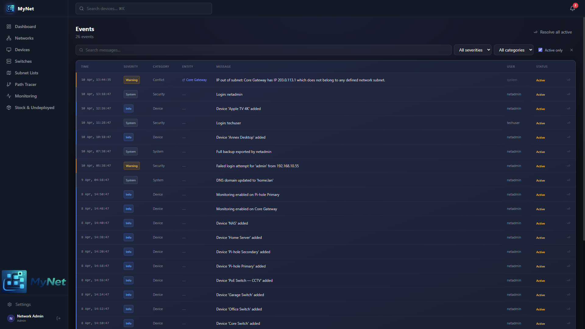

  

# Events

  

> MyNet keeps a unified event log that captures everything — device changes, network edits, monitoring alerts, IP conflicts, and system activity. Every action is attributed to a user with a timestamp.

---

## Contents

- [What Gets Logged](#what-gets-logged)
- [Event Severity & Categories](#event-severity--categories)
- [Events Page](#events-page)
- [Alert Bell](#alert-bell)
- [Acknowledging Events](#acknowledging-events)
- [Conflict Detection](#conflict-detection)

---

## What Gets Logged

| Event Type | Triggered by |
|---|---|
| Device created / updated / deleted | Any editor action on a device |
| Device deployed | Deploying from the Stock page |
| Device imported | Importing via CSV or backup restore |
| Device offline | Monitoring: consecutive ping failures exceed threshold |
| Device recovered | Monitoring: a previously-offline device responds |
| WAN offline / recovered | WAN ping target becomes unreachable / recovers |
| Network created / updated / deleted | Any editor action on a network |
| IP conflict detected / resolved | Duplicate IP found across NICs |
| MAC conflict detected / resolved / suppressed | Duplicate MAC found across NICs |
| System startup | MyNet service started |
| Backup created / restored | Export downloaded or import completed |
| User actions | Login, user creation, password changes (admin actions) |

---

## Event Severity & Categories

### Severity

| Severity | Color | Meaning |
|---|---|---|
| **Critical** | Red | Requires immediate attention (e.g. device offline, WAN down) |
| **Warning** | Amber | Something needs review (e.g. IP conflict, repeated failures) |
| **Info** | Grey | Normal activity (device edits, system startup, etc.) |

### Categories

| Category | Events included |
|---|---|
| **Monitoring** | Device offline/recovered, WAN offline/recovered |
| **Conflict** | IP conflicts, MAC conflicts |
| **Device** | Device CRUD, deployment, import |
| **Network** | Network CRUD |
| **System** | Startup, backup, restore |
| **User Action** | Admin-initiated user management |

---

## Events Page

Navigate to `/events` to see the full event log.

### Filtering

Use the filter bar to narrow events by:

| Filter | Options |
|---|---|
| **Severity** | Critical, Warning, Info |
| **Category** | Monitoring, Conflict, Device, Network, System, User Action |
| **Entity Type** | Device, Network, Location, System |
| **Active Only** | Show only unresolved events |
| **Search** | Full-text search across event messages |

### Pagination

Events are shown in reverse-chronological order, 100 per page (up to 500 total). Use **Load More** to fetch additional pages.

### Event Detail

Each event row shows:

- Severity icon and color
- Category badge
- Message
- Entity name (linked to the device or network if applicable)
- Username of the actor (or `system` for automated events)
- Timestamp
- Resolution status

---

## Alert Bell

The bell icon in the navigation bar shows a count of **unresolved critical and warning events**. Click it to jump to the Events page filtered to active alerts.

---

## Acknowledging Events

Acknowledging an event marks it as resolved. This removes it from the active alert count.

**Acknowledge a single event:** Click the checkmark icon on any event row.

**Acknowledge all:** Use the **Acknowledge All** button to bulk-resolve all active events. You can filter by severity first (e.g. acknowledge all warnings only).

> Acknowledgement is logged: the system records who acknowledged it and when.

Requires **Editor** role or higher.

---

## Conflict Detection

MyNet scans for IP and MAC address conflicts automatically:

- **On startup** — a full scan runs when the service starts
- **Every 10 minutes** — a periodic background scan checks all NICs
- **On device save** — a targeted scan runs when a device is created or edited

### IP Conflicts

Two NICs assigned the same IP address (on the same network) trigger a **Warning** event. The event names both devices.

### MAC Conflicts

Two NICs with the same MAC address trigger a **Warning** event. This can happen legitimately (e.g. a device with the same MAC on two VLANs via a trunk port). To suppress a known false-positive:

1. Open the device with the conflicting NIC
2. Edit the NIC
3. Enable **Suppress MAC conflict**

A **MAC Conflict Suppressed** info event is logged.

### Resolving Conflicts

When the duplicate IP or MAC is corrected (by editing the device), MyNet automatically creates a **conflict resolved** event and removes the active warning.

---

*← [Monitoring](monitoring.md) · [Topology →](topology.md)*
