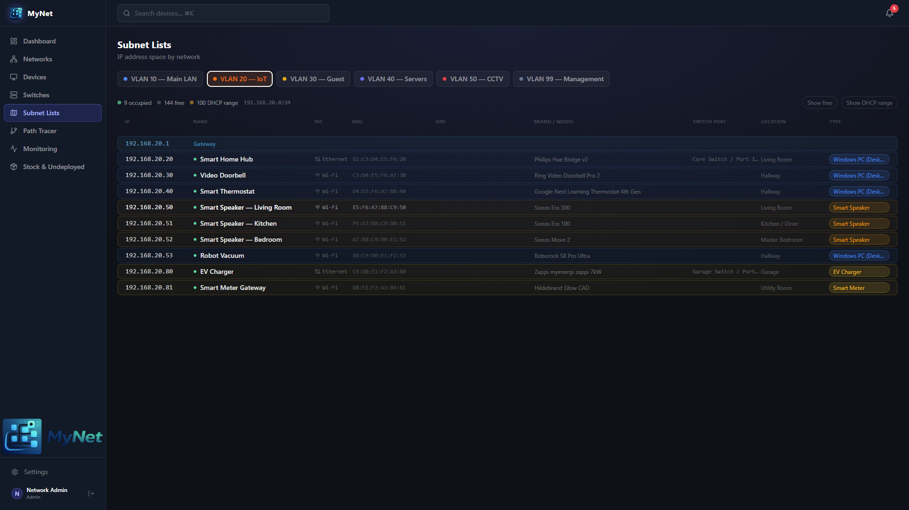
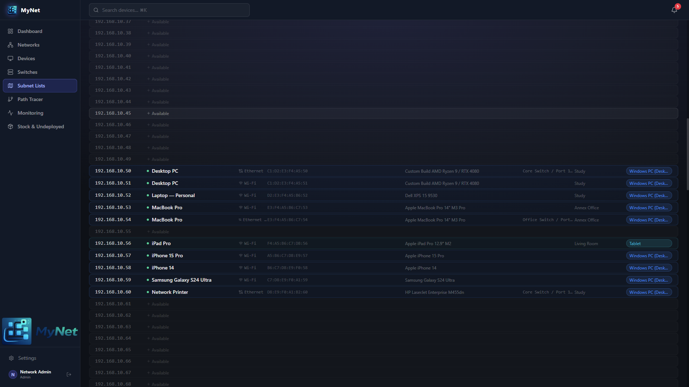

  

# Search & Filtering

  
  

> Find any device instantly by name, IP, MAC, hostname, SSID, or any other attribute. Combine filters to narrow results to exactly what you need.

---

## Contents

- [Quick Search](#quick-search)
- [Searchable Fields](#searchable-fields)
- [Filters](#filters)
- [Status Exclusions](#status-exclusions)
- [Subnet Map Search](#subnet-map-search)

---

## Quick Search

The search bar at the top of the Device List page searches across all device and NIC fields simultaneously. Type any part of a device name, IP address, MAC, hostname, or any other field — results update as you type.

Search is also available on the **Events** page (searches event messages) and the **Monitoring** page (filters the device list).

---

## Searchable Fields

### Device fields

| Field | Example searches |
|---|---|
| Name | `nas`, `pi-hole`, `office switch` |
| Use / Purpose | `media server`, `backup` |
| Hostname | `nas.local`, `pihole` |
| Brand | `synology`, `ubiquiti`, `apple` |
| Model | `DS923+`, `UAP-AC-Pro` |
| Location | `office`, `rack` |
| OS | `ubuntu`, `windows` |
| URL | `http://nas` |
| Notes | Any keyword in the notes field |

### NIC fields

| Field | Example searches |
|---|---|
| MAC Address | `aa:bb:cc`, `AA:BB` (partial match) |
| IP Address | `192.168.1`, `.100` (partial match) |
| DNS Entry | `nas.home.arpa` |
| Switch Port | `port 12`, `Uplink` |
| SSID | `HomeWiFi` |
| NIC Label | `Management`, `iDRAC` |

### Network fields (via NIC)

| Field | Example searches |
|---|---|
| Network name | `IoT VLAN`, `Guest` |
| VLAN ID | Type a number, e.g. `20` |

---

## Filters

Combine filters with search to narrow results further:

| Filter | Description |
|---|---|
| **Network** | Show only devices with a NIC on this VLAN/network |
| **Device Type** | Filter to a specific device type (e.g. Access Point) |
| **Category** | Filter to a device type category (e.g. Network Infrastructure) |
| **Status** | Show only devices with a specific status |
| **Location** | Substring match on location name |
| **NIC Type** | ETH (wired) or WIFI (wireless) |

All filters are combined with AND logic — devices must match all active filters to appear.

---

## Status Exclusions

By default, the device list excludes:

- **Stock** devices
- **Undeployed** devices
- **Decommissioned** devices

This keeps the view focused on active, in-service devices. Toggle these exclusions using the filter panel to show all statuses, or use the dedicated **Stock** page (`/stock`) for non-active inventory.

---

## Subnet Map Search

The [Subnet Map](networks.md#subnet-map) visually represents IP allocation across a subnet. Click any occupied cell to see the device details for that IP.

For large networks or when you know the IP you are looking for, the device search (filtering by IP address) is faster.

---

*← [Locations](locations.md) · [Backup & Restore →](backup-restore.md)*
