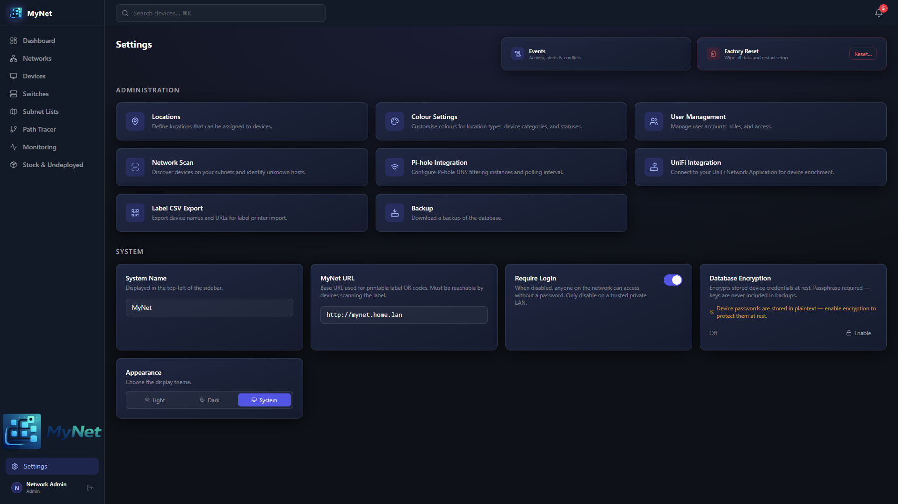

  

# Settings

  

> Configure your MyNet instance: system identity, authentication, DNS domain, appearance colors, credential encryption, and integration connections.

---

## Contents

- [General Settings](#general-settings)
- [Appearance & Colors](#appearance--colors)
- [Encryption](#encryption)
- [Pi-hole Settings](#pihole-settings)
- [UniFi Settings](#unifi-settings)
- [Label Export Settings](#label-export-settings)
- [Locations](#locations)

---

## General Settings

Navigate to **Settings** (`/settings`). Requires Admin role.

### System Name

The name displayed in the navigation bar and browser tab. Default: `MyNet`.

### Require Login

Toggle authentication on or off.

- **On** (default): Users must log in with a username and password
- **Off**: All requests are allowed without a session — suitable for a private, trusted LAN

> Cannot be disabled while encryption is enabled.

### DNS Domain

A suffix automatically appended to device hostnames when suggesting DNS entries. For example, if DNS Domain is set to `home.arpa`, a device with hostname `nas` would be suggested the DNS entry `nas.home.arpa`.

Used by Pi-hole DNS sync and the Auto DNS feature on networks.

### MyNet URL

The base URL of your MyNet installation, used when generating QR codes for device labels.

Example: `http://192.168.1.100` or `https://mynet.example.com`

Must be set before QR label generation works.

### Pi-hole Poll Interval

How frequently MyNet polls Pi-hole instances for statistics. Minimum 1 minute, default 5 minutes.

This setting takes effect after restarting the service.

---

## Appearance & Colors

Navigate to **Settings → Colours** (`/settings/colours`).

Customise the colors used throughout the UI:

### Device Status Colors

| Status | Default Color |
|---|---|
| In Service | Green |
| Undeployed | Blue |
| Stock | Amber |
| Decommissioned | Grey |

### Device Category Colors

One color per device type category (User Devices, Network Infrastructure, Servers, Entertainment, etc.).

### Location Type Colors

One color per location type label (e.g. Room, Rack, Building). Type labels are defined by the names you use when creating locations.

### WAN Port Color

The color used to highlight WAN ports in the switch port diagram. Default: Amber.

Click any color swatch to open a color picker. Changes are saved immediately.

---

## Encryption

MyNet can encrypt all stored device passwords and credentials at rest using AES-128-CBC (Fernet) with a key derived from your passphrase using PBKDF2-HMAC-SHA256 (480,000 iterations).

> **Encryption is optional and disabled by default.** When disabled, credentials are stored as plaintext in the SQLite database.

### Enabling encryption

1. Go to **Settings** and scroll to the **Encryption** section
2. Click **Enable Encryption**
3. Enter a passphrase (minimum 8 characters) and confirm it
4. Click **Enable**

MyNet will encrypt all existing device passwords immediately. A success event is logged.

> **Remember your passphrase.** It is never stored anywhere. If you lose it, stored credentials cannot be recovered.

### After a server restart

Encryption is **locked** after every restart. While locked, device passwords cannot be read or written.

To unlock:

1. Go to **Settings → Encryption**
2. Click **Unlock**
3. Enter your passphrase

Unlocking loads the derived key into memory for the current session.

### Disabling encryption

1. Go to **Settings → Encryption**
2. Click **Disable Encryption**
3. Enter your passphrase to confirm

All device passwords are decrypted and stored as plaintext again.

### Security notes

- The passphrase is never stored — only the derived key (in memory, cleared on restart)
- A verification token is stored in the database to confirm the passphrase is correct on unlock
- Authentication must be enabled before encryption can be turned on
- Backup files export passwords as ciphertext when encryption is active — they are unreadable without the original passphrase

---

## Pi-hole Settings

Navigate to **Settings → Pi-hole** (`/settings/pihole`).

Configure Pi-hole polling and manage DNS records. See [Pi-hole Integration](pihole.md) for full details.

The settings page also shows the current status of all configured Pi-hole devices (reachable, version, blocking enabled, last polled).

---

## UniFi Settings

Navigate to **Settings → UniFi** (`/settings/unifi`).

Configure the UniFi controller connection. See [UniFi Integration](unifi.md) for full details.

---

## Label Export Settings

Navigate to **Settings → Label Export** (`/settings/label-export`).

Configure the dimensions of printed labels for Brother P950NW tape (24mm at 300dpi). Defaults:

| Setting | Default |
|---|---|
| Label width | 696 px |
| Label height | 272 px |

These can also be set via environment variables (`QR_LABEL_WIDTH_PX`, `QR_LABEL_HEIGHT_PX`).

---

## Locations

Navigate to **Settings → Locations** (`/settings/locations`).

Manage the hierarchical location tree used to organise your devices. See [Locations](locations.md) for full details.

---

*← [Users](users.md) · [Pi-hole →](pihole.md)*
